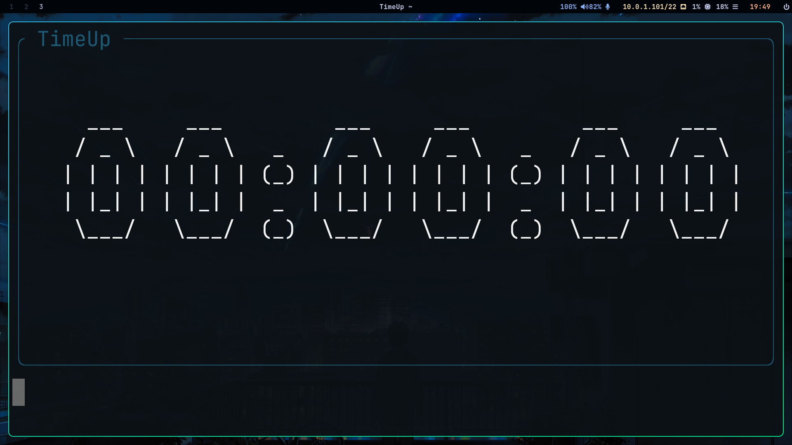

# TimeUp - A Simple Timer in Go


TimeUp is a simple timer written in Go that displays the passed time since its start. It allows users to keep track of elapsed time in a straightforward manner. Whether you're timing a task or need a quick reference for elapsed time, TimeUp provides a clean and efficient way to do so.

## Features
Displays the elapsed time in millisecounds (with -l), seconds, minutes, and hours.
Easy to use command-line interface.
Written in Go, ensuring fast and efficient performance.
Simple installation process using go install.
Installation
Prerequisites
Make sure you have Go installed on your system. You can check if Go is installed and its version by running:

```bash
go version
```
If Go is not installed, follow the instructions on the Go website to install it.

## Install TimeUp via go install
Open your terminal.
Run the following command to install TimeUp:
```bash
go install github.com/nilspolek/TimeUp@latest
```
This command will fetch and install TimeUp to your $GOPATH/bin (or $HOME/go/bin if you are using Go modules).

```bash
timeup
```
You should see the timer display showing the elapsed time.

Usage
To start the timer, simply run the following command:

```bash
# normal
TimeUp
# with millisecounds
TimeUp -l
# with another color
TimeUp -color Black
```
The timer will begin, and it will continue running until you stop it (Ctrl+C). It will display the time passed since it started in a human-readable format (hours:minutes:seconds).

Example Output
```bash
╭ TimeUp ────────────────────────────────────────────────────╮
│                                                            │
│                                                            │
│     ___     ___         ___     ___         ___     ___    │
│    / _ \   / _ \   _   / _ \   / _ \   _   / _ \   / _ \   │
│   | | | | | | | | (_) | | | | | | | | (_) | | | | | | | |  │
│   | |_| | | |_| |  _  | |_| | | |_| |  _  | |_| | | |_| |  │
│    \___/   \___/  (_)  \___/   \___/  (_)  \___/   \___/   │
│                                                            │
│                                                            │
│                                                            │
│                                                            │
╰────────────────────────────────────────────────────────────╯
```
## License
TimeUp is licensed under the MIT License. See the LICENSE file for more details.

## Contributing
If you'd like to contribute to TimeUp, feel free to fork the repository and submit a pull request. All contributions are welcome!
